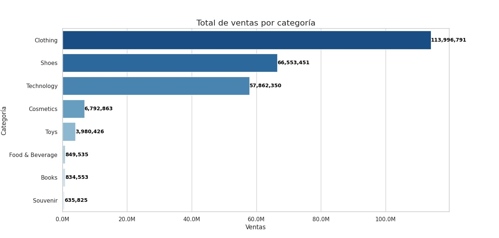

# Proyecto 1: Introducción a la ciencia de datos.


- Michael Rodriguez Arana
- Yeifer Ronaldo Muñoz Valencia
- Juan Carlos Rojas Quintero

Este informe presenta el diseño, implementación y análisis de una bodega de datos construida a partir de un conjunto de datos de transacciones de una tienda minorista. El objetivo fue transformar datos crudos en insights estratégicos para el negocio.

## 1. Diseño del Modelo de la Bodega de Datos

- Modelo elegido: Esquema Estrella 

Para este proyecto, se implementó un modelo de estrella, ya que ofrece simplicidad y un alto rendimiento para las consultas analíticas. Este diseño es ideal para los objetivos de análisis descriptivo del proyecto.

El modelo consta de: 
Una tabla de hechos central (FactSales) que almacena las métricas cuantitativas de las transacciones, como la cantidad vendida y el precio.

Cinco tablas de dimensiones que rodean a la tabla de hechos y proporcionan el contexto descriptivo:

- DimCustomer: Describe quién realizó la compra (género, edad).

- DimProduct: Describe qué se compró (categoría del producto).

- DimShoppingMall: Describe dónde se realizó la compra.

- DimDate: Describe cuándo ocurrió la transacción.
    
- DimPayment: Describe cómo se pagó la compra.

Este diseño permite filtrar y agrupar las ventas de manera eficiente a través de cualquiera de sus dimensiones, facilitando la extracción de conocimiento.

    Diagrama de la bodega de datos:

[](/images/BancoDeDatos.png)

### Scripts de creación de las tablas

```sql
-- Dimensión Cliente
CREATE TABLE dim_customer (
    customer_key SERIAL PRIMARY KEY,
    customer_id VARCHAR(50),
    gender VARCHAR(10),
    age INT
);

-- Dimensión Producto
CREATE TABLE dim_product (
    product_key SERIAL PRIMARY KEY,
    category VARCHAR(100)
);

-- Dimensión Tiempo
CREATE TABLE dim_date (
    date_key SERIAL PRIMARY KEY,
    invoice_date DATE
);

-- Dimensión Ubicación
CREATE TABLE dim_location (
    location_key SERIAL PRIMARY KEY,
    shopping_mall VARCHAR(100)
);

-- Dimensión Método de Pago
CREATE TABLE dim_payment (
    payment_key SERIAL PRIMARY KEY,
    payment_method VARCHAR(50)
);

-- Tabla de hechos
CREATE TABLE fact_sales (
    fact_id SERIAL PRIMARY KEY,
    invoice_no VARCHAR(50),
    customer_key INT REFERENCES dim_customer(customer_key),
    product_key INT REFERENCES dim_product(product_key),
    date_key INT REFERENCES dim_date(date_key),
    location_key INT REFERENCES dim_location(location_key),
    payment_key INT REFERENCES dim_payment(payment_key),
    quantity INT,
    price NUMERIC(10,2)
);
```


## 2. Extracción, Transformación y Carga de Datos.

### Documentación del Proceso ETL.

#### Creación de Tablas de Dimensiones
En esta fase, aislamos los atributos descriptivos del conjunto de datos principales para crear tablas de dimensiones. Cada tabla representará una entidad de negocio única (Cliente, Producto, Fecha, Ubicación y Método de Pago).


El método .drop_duplicates() es fundamental aquí, ya que garantiza que cada tabla de dimensión contenga solo valores únicos, eliminando la redundancia.

```python

# Crear dataframes únicos para cada dimensión
dim_customer = df[['customer_id', 'gender', 'age']].drop_duplicates().reset_index(drop=True)
dim_product = df[['category']].drop_duplicates().reset_index(drop=True)
dim_date = df[['invoice_date']].drop_duplicates().reset_index(drop=True)
dim_location = df[['shopping_mall']].drop_duplicates().reset_index(drop=True)
dim_payment = df[['payment_method']].drop_duplicates().reset_index(drop=True)


```
#### Generación de Claves Sustitutas

Una vez creadas las dimensiones, se asigna una clave sustituta a cada una.

El propósito de usar claves sustitutas en lugar de las claves de negocio originales es:

    Eficiencia: Las uniones (joins) entre tablas son mucho más rápidas con índices enteros que con cadenas de texto.

    Independencia: Desvinculan la bodega de datos de los posibles cambios en los sistemas de origen. Si un customer_id cambia, la clave sustituta interna permanece igual.

    Gestión de Historial: Facilitan la implementación de dimensiones lentamente cambiantes (SCD) si se necesitara en el futuro.
```python
# Agregar claves sustitutas
dim_customer['customer_key'] = dim_customer.index + 1
dim_product['product_key'] = dim_product.index + 1
dim_date['date_key'] = dim_date.index + 1
dim_location['location_key'] = dim_location.index + 1
dim_payment['payment_key'] = dim_payment.index + 1
```

#### Construcción de la Tabla de Hechos

Construcción de la Tabla de Hechos

Esta es la fase final donde se ensambla la tabla de hechos. Utilizando una serie de operaciones .merge(), el script vuelve a unir las dimensiones con el DataFrame original.

El objetivo de estos merge es reemplazar las columnas de texto descriptivas (ej. category, shopping_mall) por las claves sustitutas numéricas que se generaron en el paso anterior.

Finalmente, se seleccionan únicamente las columnas necesarias para la tabla de hechos:

- Las claves sustitutas de cada dimensión.

- Las métricas cuantitativas (quantity, price).

- Cualquier dimensión degenerada (invoice_no).

El resultado es una tabla de hechos compacta y optimizada.

```python
# Merge para construir la tabla de hechos
fact_sales = df.merge(dim_customer, on=['customer_id', 'gender', 'age'])
fact_sales = fact_sales.merge(dim_product, on='category')
fact_sales = fact_sales.merge(dim_date, on='invoice_date')
fact_sales = fact_sales.merge(dim_location, on='shopping_mall')
fact_sales = fact_sales.merge(dim_payment, on='payment_method')

# Seleccionar las columnas finales para la tabla de hechos
fact_sales = fact_sales[['invoice_no',
                         'customer_key',
                         'product_key',
                         'date_key',
                         'location_key',
                         'payment_key',
                         'quantity',
                         'price']]

```

#### Comprobación de que los datos han sido correctamente insertados en la base de datos.

Para comprobar si los datos fueron correctamente insertados podemos realizar una consultar basica en la base de datos.

[](ConsultaSQL.png)

## 3. Consultas Analíticas en SQL

### Total de Ventas por Categoría de Producto

[](/images/1.consulta.jpeg)

Esta consulta calcula los ingresos totales generados por cada categoría de producto, ordenándolos de mayor a menor para identificar las más importantes para el negocio.

```sql
 SELECT
    p.category,
    SUM(f.quantity * f.price) AS total_ventas
FROM fact_sales f
JOIN dim_product p ON f.product_key = p.product_key
GROUP BY p.category
ORDER BY total_ventas DESC;

```

```sql
SELECT p.category, SUM(f.quantity * f.price) AS total_ventas: Selecciona el nombre de la categoría y calcula la venta total. La venta de cada fila se obtiene multiplicando quantity por price, y luego SUM() agrega estos valores para cada categoría.

FROM fact_sales f JOIN dim_product p ON f.product_key = p.product_key: Une la tabla de hechos fact_sales con la dimensión de producto dim_product usando la clave product_key. Esto permite asociar cada venta con su respectiva categoría.

GROUP BY p.category: Agrupa todas las filas por el nombre de la categoría para que SUM() calcule el total de cada una de ellas por separado.

ORDER BY total_ventas DESC: Ordena los resultados de forma descendente, mostrando las categorías con mayores ventas primero.
```


### Clientes con mayor volumen de compras

[](/images/2.consulta.jpeg)

```sql

 SELECT
    c.customer_id,
    c.gender,
    c.age,
    SUM(f.quantity * f.price) AS total_compras,
    COUNT(DISTINCT f.invoice_no) AS numero_facturas
FROM fact_sales f
JOIN dim_customer c ON f.customer_key = c.customer_key
GROUP BY c.customer_id, c.gender, c.age
ORDER BY total_compras DESC
LIMIT 10;

```

```sql

Relaciona fact_sales con dim_customer para obtener información de los clientes.

SUM(f.quantity * f.price) da el gasto total de cada cliente.

COUNT(DISTINCT f.invoice_no) cuenta cuántas facturas (compras únicas) tiene cada cliente.

Se agrupa por cliente (GROUP BY c.customer_id, c.gender, c.age).

Se ordena de mayor a menor gasto (ORDER BY total_compras DESC).

Se limita a los 10 clientes más valiosos.
```


### Métodos de pago más utilizados.

[](/images/3.consulta.jpeg)


```sql
SELECT
    pm.payment_method,
    COUNT(*) AS cantidad_transacciones,
    SUM(f.quantity * f.price) AS total_vendido
FROM fact_sales f
JOIN dim_payment pm ON f.payment_key = pm.payment_key
GROUP BY pm.payment_method
ORDER BY cantidad_transacciones DESC;
```

```sql

Une fact_sales con dim_payment para obtener el método de pago de cada transacción.

COUNT(*) cuenta cuántas transacciones se hicieron con cada método.

SUM(f.quantity * f.price) calcula el total vendido por método de pago.

Se ordena por cantidad de transacciones (ORDER BY cantidad_transacciones DESC).

```
### Comparación de ventas por mes.
[](/images/4.consulta.jpeg)

```sql
 SELECT
    DATE_TRUNC('month', d.invoice_date)::date AS mes,
    SUM(f.quantity * f.price) AS total_ventas,
    COUNT(DISTINCT f.invoice_no) AS numero_facturas
FROM fact_sales f
JOIN dim_date d ON f.date_key = d.date_key
GROUP BY mes
ORDER BY mes;
```
```sql

Usa dim_date para obtener la fecha de cada venta.

DATE_TRUNC('month', d.invoice_date) agrupa las fechas por mes.

SUM(f.quantity * f.price) calcula las ventas totales del mes.

COUNT(DISTINCT f.invoice_no) mide el número de facturas distintas por mes.

Se ordena cronológicamente (ORDER BY mes).

```

## 4. Análisis Descriptivo y Visualización de Datos.

### Analisis realizados.

#### Total de ventas por categoría de producto.

[](images/1grafica.jpeg)


Este gráfico de barras horizontales muestra el total de ventas para cada categoría de producto, ordenadas de menor a mayor. Permite identificar rápidamente qué categorías son las más importantes para el negocio en términos de ingresos.

- La categoria dominante es claramente ropa, le siguen zapatos y tecnologia.

- Existe una diferencia enorme entre las tres categorías principales y el resto. Cosméticos, la cuarta categoría, apenas alcanza los 7 millones en ventas, lo que evidencia una alta concentración de ingresos en los productos de moda y tecnología.

- Productos como Alimentos y Bebidas, Juguetes, Libros y Recuerdos, tienen un volumen de ventas marginal en comparación con las categorías principales.

##### Conclusion

El análisis demuestra que el negocio depende fuertemente de tres pilares: Ropa, Zapatos y Tecnología. Estas tres categorías constituyen la mayor parte de los ingresos. Cualquier estrategia de crecimiento debería enfocarse en potenciar aún más estos segmentos o en desarrollar un plan para aumentar la visibilidad y las ventas de las categorías con menor rendimiento.


#### Clientes con mayor volumen de compras.

[](/images/2.grafica.jpeg)
En este grafico tenemos la distribución de los clientes con mayor volumen de compras, utilizamos un grafico de barras cuyas barras indican que proporción de clientes gastaron dentro del rango, cuyo eje x, contiene el total de compras en liras turcas, representando los rangos de gasto por clientes. Tenemos el eje Y, con el porcentaje de clientes que pertenecen a cada rango de compras.

- La mayoría de los clientes se concentra en rangos intermedios-altos de gasto. Hay picos claros alrededor de 330 TL (6.88%) y entre 1200 TL – 9600 TL (6.9% aprox. cada grupo). Esto indica que existe un grupo fuerte de clientes con un nivel de compras relativamente alto y recurrente.

- Los clientes con compras bajas (<100 TL) representan pocos casos individuales. Cada grupo pequeño (<3%) refleja que no todos los clientes hacen compras mínimas; más bien la distribución se desplaza hacia compras de mayor valor.

- Existe un comportamiento de concentración por escalas. Hay varios "bloques" de concentración:

    - Rango bajo: 5 – 200 TL (entre 1% y 3% de clientes por grupo).

    - Rango medio: ~330 TL (pico fuerte del 6.88%).

    - Rango alto: entre 1200 – 9600 TL (los porcentajes más grandes, cerca del 7%).

- Más allá de 10,000 TL (ej. 15,000 – 26,000 TL), el porcentaje baja (≈1–2%), lo que significa que son minoría los clientes muy grandes.


##### Conclusión

Como vemos el grafico no muestra una distribución normal, sino una distribución con varios picos, mostrandonos un comportamiento no uniforme, sugiriendo la existencia de subgrupos con comportamientos definidos. Para los cuales podriamos aplicar estrategias de marketing ajustados para estos subgrupos.


#### Metodos de pago más utilizados.


Para mostrar la proporcion de cada metodo de pago utilizamos un grafico de pastel.

- Efectivo: 44.7%. Es el método más utilizado, casi la mitad de las transacciones. Esto indica que los clientes todavía confían mucho en el pago directo, quizá por comodidad o falta de bancarización.

- Tarjeta de crédito: 35.1%. Representa más de un tercio de las compras. Esto es importante porque refleja un perfil de clientes que probablemente gastan más, ya que el crédito suele facilitar compras de mayor valor.

- Tarjeta de débito: 20.2%. Es el menos usado, pero no despreciable. Muestra que una parte de los clientes prefiere no endeudarse y gastar solo lo disponible.

Dado que casi la mitad de las transacciones son en efectivo, la tienda podría incentivar más el uso de pagos electrónicos (descuentos con tarjeta, puntos de lealtad).

##### Conclusión
El gráfico muestra que el efectivo sigue siendo el método dominante (44.7%), lo cual indica que una parte importante de los clientes todavía prefiere la forma tradicional de pago. Sin embargo, las tarjetas (55.3% entre crédito y débito) ya superan al efectivo en conjunto, lo que refleja una tendencia hacia la bancarización y digitalización de los pagos. La tienda debería aprovechar la alta adopción de tarjetas (sobre todo de crédito) para ofrecer programas de lealtad, descuentos exclusivos o alianzas con bancos, mientras diseña estrategias para migrar parte de los clientes en efectivo hacia métodos electrónicos, reduciendo así riesgos de manejo de dinero físico y aumentando las oportunidades de ventas mayores.

#### Tendencia de ventas por mes


- Estabilidad general (2021–2022). Durante la mayor parte del periodo, las ventas se mantuvieron entre 9 y 10 millones de TL mensuales, con pequeñas fluctuaciones normales del mercado.

- Picos y caídas puntuales:

    - Picos notables: julio 2021, septiembre 2021, marzo 2022, noviembre 2022, donde las ventas superaron ligeramente los 10 millones.

    - Caídas: febrero 2022 (~8.3M) y algunos meses de 2021 con ligeras bajas, pero siempre dentro de un rango manejable.

    - Caída abrupta en 2023:
    En febrero y marzo 2023, las ventas cayeron drásticamente, llegando a ~2.5 millones en marzo, menos de la cuarta parte del promedio habitual, rompiendo con la estabilidad general.

##### Conclusión.
Las ventas se mantuvieron sólidas y estables entre 2021 y 2022, mostrando un negocio consistente y con clientes fieles. Sin embargo, la caída repentina en 2023 representa una alerta crítica, ya que rompe la tendencia histórica y sugiere un problema externo o interno significativo. Para el negocio, es fundamental investigar las causas de esta caída.

## 5. Conclusiones.

Este proyecto demostró exitosamente el ciclo de vida completo de un análisis de datos, desde la estructuración de una bodega de datos hasta la generación de inteligencia de negocio. Las conclusiones más relevantes son:

    Alta Dependencia y Oportunidad: El negocio depende en gran medida de las categorías de Ropa, Zapatos y Tecnología. Si bien esto representa un riesgo, también es una oportunidad para enfocar estrategias de marketing de alta precisión en estos segmentos o para diseñar planes de crecimiento en las categorías de menor rendimiento.

    La Estacionalidad como Herramienta Estratégica: El patrón de ventas anual es claro y predecible. La empresa puede utilizar este conocimiento para optimizar la gestión de inventario, planificar campañas de marketing para suavizar los valles de ventas (como en febrero) y realizar pronósticos financieros más acertados.

    El Valor de los Clientes Leales: Existe un segmento de clientes "top" cuyo comportamiento de compra es muy similar y de alto valor. Identificar y retener a este grupo a través de programas de fidelización es crucial para garantizar un flujo de ingresos estable y de alto margen.
